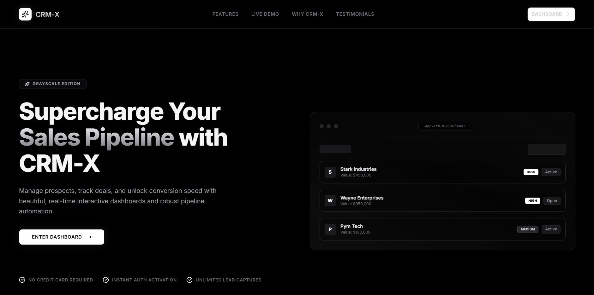

# CRM-X — Premium Growth & Relationship Management



## Overview

**CRM-X** is a next-generation Customer Relationship Management platform. Engineered as a high-performance monorepo, it combines state-of-the-art Web UI design, client-server decoupling, and advanced automation to streamline sales pipelines, leads tracking, and relationship data integrity.

Designed with **rich aesthetics**, the dashboard features beautiful glassmorphism, adaptive dark mode compliance, and precise micro-interactions for a premium CRM experience.

## 🛠️ Tech Stack

### Client (`apps/crm-client`)
- **Framework**: Next.js 16 (App Router, Client Components)
- **Styling**: Tailwind CSS & custom glassmorphism systems
- **Animations**: Framer Motion (staggered listings, springs, and exit animations)
- **Icons**: Lucide React
- **Notifications**: React-Toastify

### Server (`apps/crm-server`)
- **Runtime**: Node.js
- **Framework**: Express API services
- **Database Utilities**: Custom schema routing

### Packages (`packages/*`)
- **Shared UI**: Custom React element component stubs (`@repo/ui`)
- **Linter & Configurations**: ESLint and TypeScript configs (`@repo/eslint-config`, `@repo/typescript-config`)

---

## 🚀 Getting Started

### Prerequisites

Ensure you have **Node.js >= 18** and **pnpm** installed globally:

```sh
npm install -g pnpm
```

### Installation

1. Clone the repository and navigate into the project root:
   ```sh
   cd crm-x
   ```
2. Install monorepo dependencies:
   ```sh
   pnpm install
   ```

### Command Reference

The platform utilizes **Turborepo** to orchestrate workspace pipeline commands:

| Command | Action |
| :--- | :--- |
| `pnpm run dev` | Spins up the client (`:3000`) and server (`:5000`) development instances concurrently |
| `pnpm run build` | Compiles production bundles for all applications and packages |
| `pnpm run lint` | Runs ESLint checks across the entire codebase |
| `pnpm run check-types` | Executes TypeScript typechecks in every application and package workspace |
| `pnpm run format` | Runs Prettier to format markdown, typescript, and styling code |

---

## 📂 Project Structure

```
crm-x/
├── apps/
│   ├── crm-client/         # Next.js CRM Dashboard Application
│   └── crm-server/         # Express Node Backend API Services
├── packages/
│   ├── ui/                 # Shared React component workspace
│   ├── eslint-config/      # Shared ESLint configuration
│   └── typescript-config/  # Shared tsconfig blueprints
├── pnpm-workspace.yaml     # Workspace declaration map
├── turbo.json              # Turborepo task pipeline rules
└── README.md               # Primary project documentation
```
